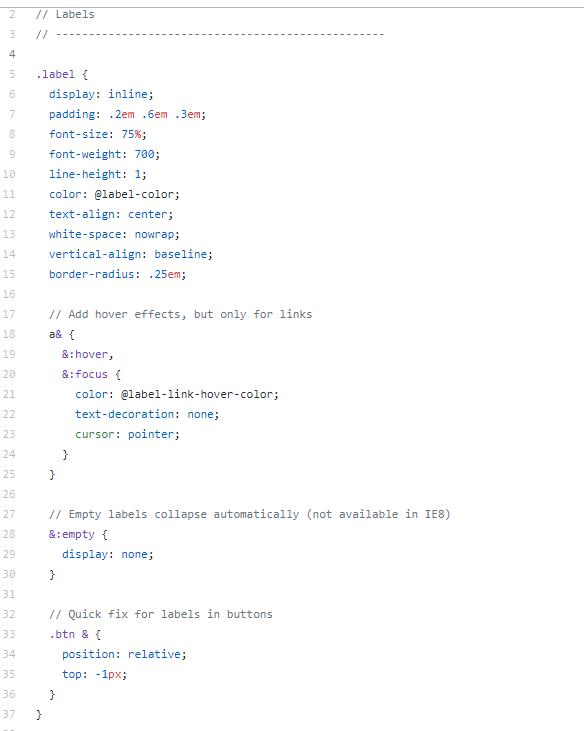
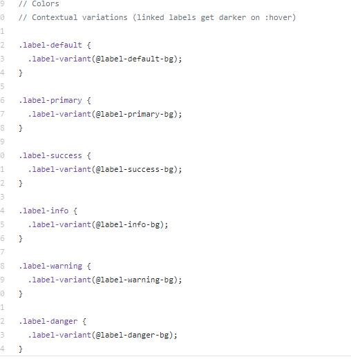

# CSS 代码命名及组织规范: BEM OOCSS SMACSS ACSS

## BEM

> BEM: Block Element Modifier

Block: header, container, menu, checkbox, input
Element: menu item, list item, checkbox caption, header title
Modifier: disabled, highlighted, checked, fixed, size, color

### 说明

BEM 优点:

* css 没有嵌套，代码结构清晰

BEM 缺点:

* css class名过长
* css 内容冗余

Block 表示 能被封装的一个有意义实体区域。 ```.block {}```
Element 表示 block的一部分，没有实体意义，```.block__element {}```
Modifier 表示 Block/Element的特征(样式，行为，状态) ```.block__element--color-red```

_案例_

```html
<form class="bem-form bem-form--them-xmas btm-form--simple">
    <input class="bem-form__input" type="text" />
    <input class="bem-form__submit bem-form__submit--disabled" type="submit" />
</div>
```

```css
.bem-form {}
.bem-form--theme-xmas {}
.bem-form--simple {}
.bem-form__input {}
.bem-form__submit {}
.bem-form__submit--disabled {}
```

## OOCSS

> OOCSS: Object Oriented CSS 利用面向对象的思想(模块化，单一功能原则，关注点分离)组织CSS代码 (Boostrap v3 less根据此规范编写)

* 关注点分离: 结构和外观分离
* 单一功能: 容器和内容分离，样式内容不应该依赖具体单一的容器。

**优点**

* 结构与样式分离

_案例_

```html
<div class="media">
    
    <div class="bd txtR">OOCSS desc</div>
</div>
```

```css
// 结构
.media {
    margin: 10px;
}

.media .pic {
    float: left;
    margin-left: 10px;
    width: 260px;
}

.media .bd {
    margin-right: 300px;
}

// 样式内容
.txtC {
    text-align: center;
}

.txtR {
    text-align: right;
}
```




## SMACSS

> SMACSS: Scalable and Modular Architecture for CSS 可伸缩 模块化架构的CSS

**将CSS分为5类**

1. Base
2. Layout
3. Module
4. State
5. Theme

**Base**

> 基础样式，如reset/normalize.css

**Layout**

> 布局样式，(左右分栏 栅格化布局等) ['l-/layout-']

**Module**

> 模块样式，页面中一块有实际意义的部分 (productList, todoList) ['todo-']

**State**

> 状态样式，用于描述 布局/模块 (大小，显隐等) ['is-']

**Theme**

> 主题样式，专门分离开来用于切换的样式主题 (非必须 通常不需要) ['.theme-']

```css
/* Example Module */
.example { }

/* TODO Module */
.todo { }

/* TODO Module with State */
.todo.is-collapsed { }

/* Form field module */
.field { }

/* Inline layout  */
.l-inline { }
```

**最小适配深度原则**

```js
.siderbar ul h3 {}

.sider-title {}
```

## ACSS

> ACSS: Atomic CSS 原子化CSS (与其他的关注点分离原则不同, acss强调关注点集中)

优点:

* 代码冗余度低

```css
.FL {
    float: left;
}
.M10 {
    margin: 10px;
}
.MR10 {
    margin-right: 10px;
}
.Ell {
    text-overflow:ellipsis;
}
.IbBox {
    display: inline-block;
    *display: inline;
    zoom: 1;
    vertical-align: top;
}
```

## 个人 Best Practice

* 原则: 结构与样式分离

1. 结构命名规则使用BEM规范
2. 对于嵌套规则过深的结构，命名过于冗长。参考"最小适配深度原则"进行优化(仅是命名的优化，不涉及嵌套结构，因为嵌套结构通过BEM拍平了)
3. 针对样式规则。使用ACSS + SMACSS进行拆分组合。
4. page -> root -> section -> namespace (module) "todo" / bem结构也为可复用结构 -> 变化部分抽离成布局atomic css

_案例_

```html
<div class="todo">
    <div class="todo-item">
        <div class="todo-item-status">uncheck</div>
        <div class="todo-item-label">important</div>
        <div class="todo-item-title">todo thing 1</div>
        <div class="todo-item-content">
           <p class="todo-item-content-desc">todo thing description</p>
        </div>
    </div>
</div>

<!-- 最小适配深度原则 -> 优化(首字母+驼峰 命名) -->
<div class="todo">
    <div class="todoI">
        <div class="FL FL-JCB FL-ACC P10">
            <div class="todoI-status TCBlue TxtOF">uncheck</div>
            <div class="todoI-label TCBlue TxtOF">important</div>
            <div class="todoI-title TCRed TxtOF">todo thing 1</div>
        </div>
        <div class="todoIC FL FL-JCB FL-AIC P10">
           <p class="todoIC-desc TCBlue">todo thing description</p>
        </div>
    </div>
</div>
```

```css
// 结构(有依赖关系) -> position margin width height...
.todo {}
.todo-item {}
.todo-item-status {}
.todo-item-label {}
.todo-item-title {}
.todo-item-content {}
.todo-item-content-desc {}


// 结构 opt
.todo {}
.todoI {
    margin: 10px 0;
}
.todoI-status {
    width: 60px;
}
.todoI-label {
    width: 100px;
}
.todoI-title {
    flex: 1;
}
.todoIC {
    height: 300px;
}
.todoIC-desc {
    width: 50%;
}

// 样式(atomic) -> padding background color...
.FL {
    display: flex;
}
.FL-JCB {
    justify-content: space-between;
}
.FL-JCC {
    justify-content: center;
}
.FL-JCR {
    justify-content: space-around;
}
.FL-AIC {
    align-items: center;
}
.P10 {
    padding: 10px;
}
.PL10 {
    padding-left: 10px;
}
.TCBlue {
    color: blue;
}
.TCRed {
    color: red;
}
.TxtOF {
    overflow: hidden;
    white-space: nowrap;
    text-overflow: ellipsis;
}
```

## 参考 Reference

[BEM](http://getbem.com/introduction/)
[OOCSS wiki](https://github.com/stubbornella/oocss/wiki)
[SMACSS](http://smacss.com/)
[ACSS](https://acss.io/guides/atomic-classes.html)

